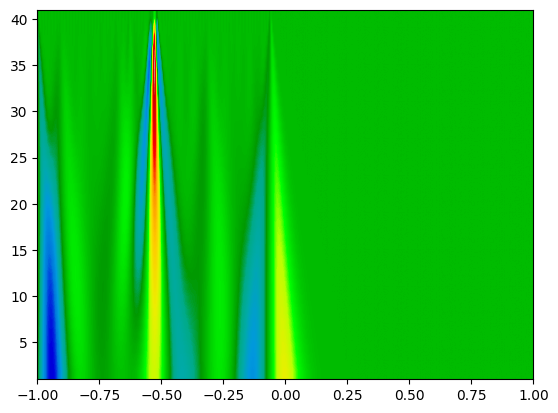

# Details of the Processed MIT-BIH Arrhythmia Database
Consists of 48 two-lead ECGs from 47 subjects which are sampled at 360 Hz and each record covers 30 minutes.

**Group 1 (100-124):** Representative sample of the variety of waveforms and artifacts that an arrhythmia detector might encounter in routine clinical use

**Group 2 (200 to 234):** Complex ventricular, junctional, and supraventricular arrhythmias and conduction abnormalities (selected for features of the rhythm, QRS morphology variation, or signal quality that may be expected to present significant difficulty to arrhythmia detectors)

## Beat Category Distribution

MIT-BIH beat types were grouped into the five AAMI beat classes.

`classes_reduced = {'N':['N','L','R','e','j'], 'S':['S','A','a','J'] 'V':['V','E'],'F':['F'],'Q':['/','Q','f']}`

## Signal Preparation

- Butterworth bandpass filter applied to remove noise
- Signal values normalized between 0 and 1

## Segmentation

Segments are centered at the R peak and their lengths depend on the surrounding RR intervals of the annotated beat.  
- Take the minimum of the RR intervals on the left and right of the annotated beat
- If `2 * 0.8` of the minimum is greater than `1000` samples or less than `100`, the beat is not segmented
- Right side zero padding to the length `966`  

  
Lengths of the segments

## Scalogram Format

Scalogram resolution is `(len(widths), len(data))`. For most instances, the resolution is `(31, 966)`.

Obtained through continuous wavelet transform with the `Ricker` wavelet.
