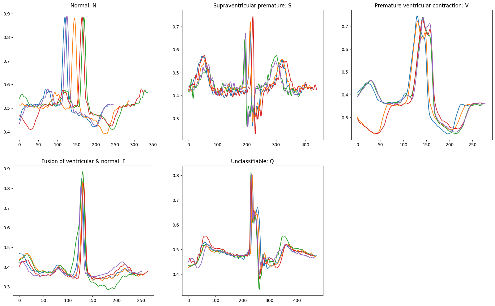

# Details of the Processed MIT-BIH Arrhythmia Database
The MIT-BIH Arrhythmia database consists of 48 two-lead ECGs from 47 subjects which are sampled at 360 Hz and each record covers 30 minutes.

**Group 1 (100-124):** Representative sample of the variety of waveforms and artifacts that an arrhythmia detector might encounter in routine clinical use

**Group 2 (200 to 234):** Complex ventricular, junctional, and supraventricular arrhythmias and conduction abnormalities (selected for features of the rhythm, QRS morphology variation, or signal quality that may be expected to present significant difficulty to arrhythmia detectors)

## Beat Category Distribution

MIT-BIH beat types were grouped into the five overarching AAMI beat classes.

**N (Normal beat):** N beats are considered a normal heartbeat and originate from the natural pacemaker of the heart, the sinoatrial (SA) node.
> (N) Normal beat  
> (L) Left bundle branch block beat  
> (R) Right bundle branch block beat  
> (e) Atrial escape beat  
> (j) Nodal (junctional) escape beat  

**S (Supraventricular premature beat):** S beats, also known as a premature atrial contraction (PAC), typically have a narrow and irregular QRS complex shape due to the abnormal early activation of the atria.
> (S) Supraventricular premature beat  
> (A) Atrial premature beat  
> (a) Aberrated atrial premature beat  
> (J) Nodal (junctional) premature beat  

**V (Premature ventricular contraction):** V beats originate from a premature ventricular contraction and typically have a wide QRS complex shape due to the abnormal activation of the ventricles.
> (V) Premature ventricular contraction  
> (E) Ventricular escape beat  

**F (Fusion of ventricular & normal beat):** F beats occur when a supraventricular beat and a ventricular beat occur at the same time, resulting in a QRS complex that looks like a combination of the two.
> (F) Fusion of ventricular & normal beat  

**Q (Unclassifiable beat):** Q beats do not exactly fit into any of the above categories, typically having an indeterminate QRS complex shape, as the origin and type of the heartbeat cannot be classified.
> (/) Paced beat  
> (Q) Unclassifiable beat  
> (f) Fusion of paced & normal beat  

Distribution of the five main classes in the database

Grouping these classes proves to be realistic as the morphologies are similar between beats under the same AAMI class.

## Signal Processing

The patient IDs are located in the `RECORDS` file.

The following steps are performed for each patient ID:
- The ECG signal is extracted from the record of the patient ID using the `wfdb` package
- Butterworth bandpass filter is applied to remove noise
  - High pass and low pass
- Signal values are normalized between `0` and `1`

## Segmentation

Segments are centered at the R peak. Their lengths depend on the surrounding RR intervals of the annotated beat. This guarantees only one QRS complex per segment, but the segments will vary in length.
- Record the RR intervals on the left and right of the annotated beat. Take their minimum.
    - RR intervals are calculated by subtracting the locations of two consecutive annotations
- Take 80% of the minimum interval for the number of samples to keep on the left and right of the annotated beat
    - If the segment length (`2 * 0.8` of the minimum) is greater than `1000` samples or less than `100`, the segment is not kept
    - Reduce the segments with suspicious morphologies and the isolated annotated beats with extremely long length
  
Lengths of the segments

## Scalogram Format

Scalogram resolution is `(len(widths), len(data))`. For most instances, the resolution is `(31, 966)`.

Scalograms are generated through continuous wavelet transform with the `Ricker` wavelet.

## Padding
The longest 

## Data Saving

Data is saved in a file named `db.npz` which contains two arrays:  
>`segments`: This is a 2D array where each row corresponds to a matrix representing an ECG scalogram. Each segment is represented as a 1D array of floating-point numbers.    

> `labels`: This is a 1D array containing the class labels for each segment as numbers `{0:'N',1:'S',2:'V',3:'F',4:'Q'}`. 